# readme-stats-cards

[](LICENSE)
[](action.yml)

A GitHub composite action that generates and commits GitHub stats and top languages SVG cards to your profile repo.

## Preview

<p align="center">
  
  
</p>

## Why this Action?

Most stats cards rely on a hosted server re-rendering on every page load. This action generates the SVGs on a schedule and commits them directly to your repo, so they load instantly and work even if the upstream API is down.

## Prerequisites

> [!IMPORTANT]
> Your workflow **must** include `actions/checkout@v4` before this action. Without it, the commit and push step will fail because there is no local git repository.

## Usage

Create `.github/workflows/readme-cards.yml` in your profile repo (`USERNAME/USERNAME`):

```yaml
name: Update README cards

on:
  schedule:
    - cron: "0 3 * * *"
  workflow_dispatch:

permissions:
  contents: write

jobs:
  build:
    runs-on: ubuntu-latest
    steps:
      - uses: actions/checkout@v4

      - uses: Joydeep2005Banik/readme-stats-cards@v1
        with:
          username: your-github-username
          token: ${{ secrets.GITHUB_TOKEN }}
```

Then add to your `README.md`:

```html
<p align="center">
  
  
</p>
```

### Generate Only One Card

```yaml
- uses: Joydeep2005Banik/readme-stats-cards@v1
  with:
    username: your-github-username
    token: ${{ secrets.GITHUB_TOKEN }}
    cards: "stats"          # Only generate the stats card
```

### Custom Commit Message

```yaml
- uses: Joydeep2005Banik/readme-stats-cards@v1
  with:
    username: your-github-username
    token: ${{ secrets.GITHUB_TOKEN }}
    commit_message: "chore: refresh profile cards"
```

## Inputs

| Input | Required | Default | Description |
|---|---|---|---|
| `username` | yes | — | Your GitHub username |
| `token` | yes | — | GitHub token (see [Token Permissions](#token-permissions)) |
| `theme` | no | `tokyonight` | Card theme (see [Available Themes](#available-themes)) |
| `output_dir` | no | `profile` | Directory to save SVGs |
| `cards` | no | `stats,top-langs` | Comma-separated list of cards to generate (`stats`, `top-langs`) |
| `commit_message` | no | `Update README cards` | Custom commit message for the card update |
| `stats_options` | no | `show_icons=true&hide_border=true` | Extra query params for stats card |
| `top_langs_options` | no | `layout=compact&hide_border=true` | Extra query params for top languages card |

## Token Permissions

> [!WARNING]
> The default `secrets.GITHUB_TOKEN` only works for **public** repository stats. If you need stats from **private** repositories, you must use a **Personal Access Token (PAT)** with the following scopes:
> - `repo` — access private repository data
> - `read:user` — access user profile data
>
> Store the PAT as a repository secret (e.g. `secrets.STATS_PAT`) and use it instead:
> ```yaml
> token: ${{ secrets.STATS_PAT }}
> ```

## Available Themes

You can set the `theme` input to any of the following built-in themes:

| | | | |
|---|---|---|---|
| `default` | `dark` | `radical` | `merko` |
| `gruvbox` | `tokyonight` | `onedark` | `cobalt` |
| `synthwave` | `highcontrast` | `dracula` | `prussian` |
| `monokai` | `vue` | `vue-dark` | `shades-of-purple` |
| `nightowl` | `buefy` | `blue-green` | `algolia` |
| `great-gatsby` | `darcula` | `bear` | `solarized-dark` |
| `solarized-light` | `chartreuse-dark` | `nord` | `gotham` |
| `material-palenight` | `graywhite` | `vision-friendly-dark` | `ayu-mirage` |
| `midnight-purple` | `calm` | `flag-india` | `omni` |
| `react` | `jolly` | `maroongold` | `yeblu` |
| `blueberry` | `slateorange` | `kacho_ga` | `outrun` |
| `ocean_dark` | `city_lights` | `github_dark` | `github_dark_dimmed` |
| `transparent` | `noctis_minimus` | `aura_dark` | `rose_pine` |

> [!TIP]
> You can also fully customize colors without using a theme by passing options like `bg_color`, `text_color`, `title_color`, `icon_color`, and `border_color` via the `stats_options` or `top_langs_options` inputs.

## Troubleshooting

### Cards are not updating

1. Check that the workflow ran successfully in the **Actions** tab of your repo.
2. Make sure `permissions: contents: write` is set in your workflow.
3. If your branch is protected, the push step will fail — consider using a branch without protection rules.

### Empty or incomplete stats

- The default `GITHUB_TOKEN` cannot access private repo data. Use a PAT with `repo` and `read:user` scopes (see [Token Permissions](#token-permissions)).

### "Nothing to commit" message

- This is normal! If the cards haven't changed since the last run, the action skips the commit. This is not an error.

### Invalid card type error

- The `cards` input only accepts `stats` and `top-langs` (comma-separated). Check for typos.

### Git errors about "not a git repository"

- Make sure `actions/checkout@v4` runs **before** this action in your workflow. See [Prerequisites](#prerequisites).

## Releases

This action follows semantic versioning. Check the [Releases](https://github.com/Joydeep2005Banik/readme-stats-cards/releases) page for the latest version and changelog.

> [!NOTE]
> The `@v1` tag points to the latest `v1.x.x` release. For maximum stability, you can pin to a specific version like `@v1.0.0`.

## Contributing

Contributions are welcome! See [CONTRIBUTING.md](CONTRIBUTING.md) for guidelines.

## License

This project is licensed under the [MIT License](LICENSE).
